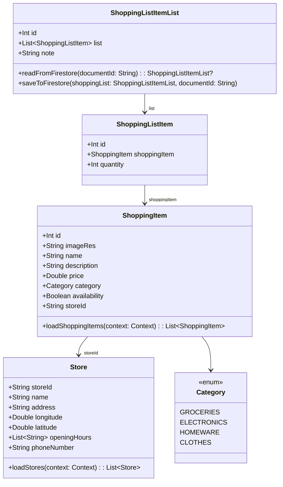
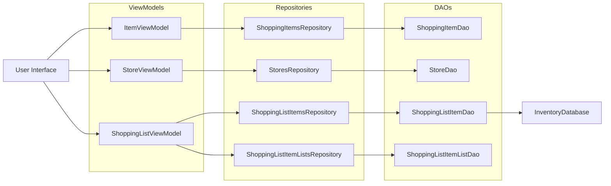
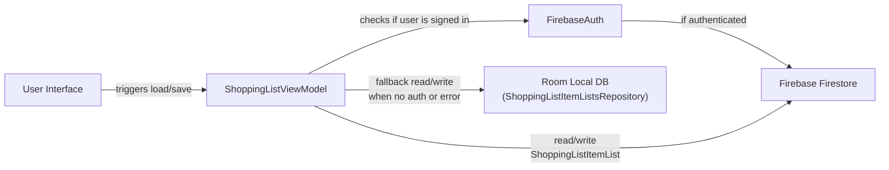

# Technical Report // README

## Discussion of Functionality

### What is Besco ?

Besco is a shopping app where users can create shopping lists for their favorite items to help them navigate their shop! Its features include:

- **Browse:** Viewing shopping items either from all stores, or a specific one. They can also filter on specific item categories, or search for their items, to help simplify their experience.
- **Shopping List:** Users can add their shopping items to a list, saved locally and online using [Firestore](https://firebase.google.com/docs/firestore). They can also personalise their list with a note!
- **Store selection:** Choosing a store either through [Google Maps plugin](https://developers.google.com/maps/documentation/android-sdk/maps-compose), or browsing store cards.
- **Account:** Users can [Sign in with Google](https://firebase.google.com/docs/auth/android/google-signin) or [email/password](https://firebase.google.com/docs/auth/android/password-auth#sign_in_a_user_with_an_email_address_and_password) . When signed in, their shopping lists are saved in Firestore.

As part of my Mobile App Development 2 module in my final year, Besco simplifies the shopping experience by allowing users to check store availability and plan their shop before leaving the house. 

## UML + Class Diagrams

Below shows the diagrams that explain the Data Classes and Storage Mechanisms in place.

### Data Classes

### ROOM Database

### Firebase and ROOM Storage mechanisms

## UX / DX Approach Adopted

Below outlines the UX / DX Approach used within development of the mobile application, Besco .

### Jetpack Compose

[Jetpack Compose](https://developer.android.com/compose) was used as it is a modern approach to mobile application development. It is a modern toolkit framework that advances Android app development by simplifying the development process through better use of UI frameworks and Kotlin.

Jetpack Compose does this with:

- **Less dependency on XML documents, and more focus on Kotlin** : Jetpack Compose relies less on XML documents for creating UI elements, as seen in previous Android development framework iterations. Instead, it favors using Kotlin to programmatically design the UI and logic. [Less Code](https://developer.android.com/develop/ui/compose/why-adopt#less-code) is one of Jetpack Compose's key selling points.
- **MaterialUI Integration for better developer and UI experience** : Jetpack Compose is tightly integrated with [Material3](https://developer.android.com/develop/ui/compose/designsystems/material3) framework, enabling a plethora of widgets and components to be easily integrated into the mobile application.

By using Jetpack Compose, it allowed me to utilise Kotlin primarily as the interface for creating the app, through logic via Kotlin and UI implementation via Material3 components. 

## Git Approach Adopted

Below outlines the developmental approach taken using Git . 

### GitHub Projects

[GitHub Projects](https://docs.github.com/en/issues/planning-and-tracking-with-projects/learning-about-projects/about-projects) was used as the primary tool for planning and development throughout the project. It is project planning tool that allows developers to plan their next moves for their project, through iterations, tasks, subtasks, user task assignment, deadlines, etc.

With GitHub Projects, I planned iterations and tasks through the charts feature. With charts, you can customise your planning board through varied development processes. 

In my case, I used default KanBan chart as it suited my needs most. I found it very useful in planning the tasks required to complete the project. 

[Besco Shopping List App](https://github.com/users/evanhearne/projects/1) is where I planned and achieved tasks for the project. 

### Releases

[GitHub Releases](https://docs.github.com/en/repositories/releasing-projects-on-github/about-releases) was used to deploy iterations of the project during development. It is a tool that allows developers to create releases/tags of developmental points of their project.

Using Releases, I created `v0.4.0-ca2_good` release of the app as this is where I place my app in terms of grading for CA 2. However, I did use Releases for other developmental points during CA1 development. 

### GitHub Repository

You can find my work completed [here](https://github.com/evanhearne/mad2-assignment-one) if viewing this README locally. 

## Personal Statement

### Formality

I declare that all work completed on this repository is my own.

### Reflection

- It takes a lot to build a mobile application - a lot of moving parts were used in the development of this project, such as Firebase Auth, Firestore, and ROOM. 
- Some components were often going against each other during development, such as Firestore and ROOM, where bugs were often found with anonymous login for image display, for example.
- Feedback from SETU Lecturer, Dave Drohan, helped me to see improvements that could be made within the app. This should hopefully help with getting a better grade. :)
- Undertaking Mobile App Development 2 as an elective module helped me learn a lot about mobile app development, and the tools out there, such as Firebase or Google Maps, for improving app functionality through geo-location, authentication and storage solutions.
- If I had more time, it would have been nice to implement [Firebase UI](https://firebase.google.com/docs/auth/web/firebaseui) for a universal look and feel to app authentication.
- I would have also liked to have added Dark Mode functionality - it shows up in some cases but was not implemented purposefully.
- ROOM was a challenge for me to implement, even since Mobile App Development 1! I wanted to implement it to get a better understanding of local database storage within Android. I was able to do this, and can see its benefit for storing objects for offline use.

## References

References to tools mentioned have been made in Markdown throughout the document, and references to any new tools used or methods, can be found on my project board, or within the codebase.

However, I believe the following references are critical to the app's functionality:

|Name|Link|Purpose|
|----|----|-------|
|ROOM Tutorial|https://developer.android.com/codelabs/basic-android-kotlin-compose-persisting-data-room#0|Provided a working example of ROOM in action for local database storage.|
|Firestore Quickstart|https://firebase.google.com/docs/firestore/quickstart|Easy to read documentation on Firestore implementation.|
|Firebase Authentication Get Started|https://firebase.google.com/docs/auth/android/start|Similar reason to above.|
|Firebase Storage Get Started|https://firebase.google.com/docs/storage/android/start|Similar to above - but video provided easy understanding of implementation.|

